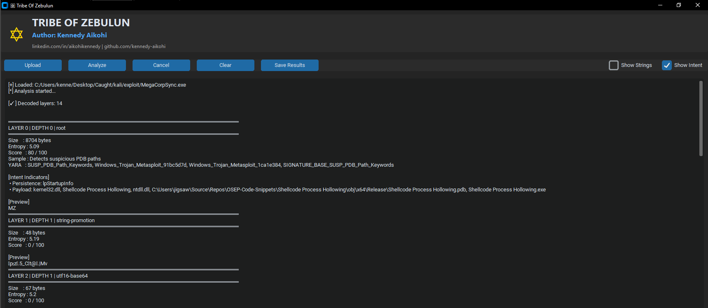

# ✡ Tribe Of Zebulun

**Tribe Of Zebulun** is a DFIR-focused malware analysis and recursive payload decoding framework designed to extract, decode, classify, and attribute malicious content hidden inside documents, scripts, and binaries.

It is purpose-built for:
- Malware Analysts
- Incident Responders
- Threat Hunters
- DFIR Practitioners
- Technical Interviews & Portfolio Demonstration

---

## 🎥 Project Demo

[]

▶ Click the image above to watch the full demo walkthrough

---

## 🔍 Key Capabilities

- Recursive multi-layer payload decoding
- PowerShell `-EncodedCommand` extraction
- Base64 / UTF-16 / string promotion
- Embedded archive unpacking
- PE file & shellcode carving
- YARA-based malware family attribution
- Intent classification:
  - Execution
  - Network
  - Persistence
  - Evasion
- Entropy-based obfuscation scoring
- Interactive GUI (CustomTkinter)
- Designed for **real DFIR workflows**

---

## 🧠 Architecture Overview

Tribe Of Zebulun is built as a **layered analysis engine**:

